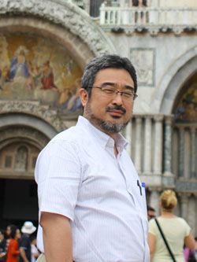

### 研究室紹介

修復生態学研究室は、「水圏環境の保全と破壊された水圏環境の修復、水圏環境に負荷をかけない技術」の研究と開発を行っています。その研究範囲は、水圏生態学、プランクトン学、生態工学、水処理科学、廃棄物工学などの広い学問分野に及びます。

- 生態系を保全し、傷ついた生態系を修復する

  まず、対象となる水圏生態系の構造と機能をよく理解する必要があります。生態系が正常に維持されているメカニズムを知らなくてはなりません。当研究室では、相模湾の沿岸生態系やマレーシアのサンゴ礁を対象に、食物網や物質循環についていろいろな角度から研究を実施しています。特に、低次生産生物群集（植物プランクトン―動物プランクトン）は生態系を支える基盤生物群であり、それらについては、分布や鉛直移動、生産生態などの様々な研究を行っています。このような研究は、地球環境の変化に対する生態系の応答を予測するためにもとても重要です。相模湾の沿岸では 20 年にわたって海洋観測が実施され、海洋環境の物理化学的変動、プランクトンの質や量の変化、赤潮、台風の影響などについて調べています。

- 生態系と人間の共存

  地球上には 1000 万種以上の生物が生息していると推定されています。人間はその中の１種にすぎません。われわれの生活は食料をはじめとして、その多くを他の生物に依存しています。ですから、生態系を保全して持続的に利用していく以外に道はないのです。
  そこで当研究室では、人間活動から出る排出物をいかに適正に処理し、水圏への環境負荷を低減するかということについても研究しています。それらは、生態工学や水処理科学と言われている分野であり、微生物や植物プランクトンを利用した排水処理、有機性廃棄物の適正処理プロセスや環境影響評価に関する研究などを実施しています。微生物や植物プランクトンによる環境浄化技術はコストがかからないために途上国への技術移転としても有望で、東南アジアの研究機関と共同研究を実施しています。また、琵琶湖に過剰繁茂する水草の利活用に関する研究や、長崎県新上五島町における藻場造成に関する実証試験は、新しい循環型社会構築への取り組みで、人と自然の共生を目指しています。

#### 指導教授紹介

##### 戸田龍樹

【学歴】
昭和 59 年 北海道大学水産学部水産増殖学科卒業（水産学士）
昭和 61 年 北海道大学大学院水産学研究科修士課程修了（水産学修士）
平成 2 年 東京大学大学院農学系研究科博士課程修了（農学博士）

【主な職歴】
平成 2 年 東京大学海洋研究所 日本学術振興会特別研究員
平成 7 年 創価大学工学部生物工学科 助教授
平成 14 年 同大 環境技術共同開発センター長
平成 15 年 同大 工学部環境共生工学科 教授
平成 17 年 同大 工学部環境共生工学科長
平成 25 年 同大 工学研究科環境共生工学専攻長
平成 27 年 同大 工学研究科長
その他、横浜国立大学教育人間科学部、東京農工大学農学部・工学部などで非常勤講師、マレーシア国民大学客員教授など歴任。

【近年の主な研究内容・社会活動歴】
修復生態学、浮遊生物学、生態工学。海洋生態系の低次生産動態の研究、沿岸環境の修復生態学に関する研究に従事。近年は生態系の修復工学に関する研究を行い、生態工学を利用した有機性廃棄物の処理装置の開発や、単細胞藻類によるバイオマスエネルギーの研究を行っている。
平成 14 ～ 15 年度経済産業省地域新生コンソーシアム総括研究代表。平成 16 ～ 20
年度文部科学省学術研究高度化推進事業産学連携プロジェクト研究代表。平成 20 ～ 22
年度環境省循環型社会形成事業研究代表。平成 21 ～ 25 年度文部科学省
私立大学戦略的研究基盤形成支援事業研究代表平成 26 年度～　環境省循環境研究総合推進費サブテーマ代表など。日本学術振興会（JSPS）拠点大学交流事業、アジア研究教育拠点事業協力研究者として東南アジア諸国で研究技術指導、派遣研究者の受け入れなど国際協力事業に参画。日本電子（株）、三洋テクノマリン（株）、太平洋セメント（株）などとの産学共同研究を推進。
